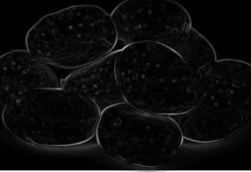

# Sobel 边缘检测

纯 numpy 实现的 Sobel 边缘检测工具，支持阈值过滤、梯度方向分类和可视化对比。

## 效果演示

| 原图 | 边缘检测 |
|---|---|
|  |  |

## 安装

```bash
py -m pip install -r requirements.txt
```

## 运行测试

```bash
py -m pytest tests/ -v
```

## 使用

```python
from sobel_edge import load_image, sobel_edge, sobel_gradient_direction, classify_direction, compare_plot, save_image

# 加载图片（支持文件路径或 numpy 数组）
img = load_image("photo.jpg")

# 基础边缘检测
edge = sobel_edge(img)

# 带阈值的边缘检测
edge_filtered = sobel_edge(img, threshold=100)

# 梯度方向（弧度）
angles = sobel_gradient_direction(img)

# 方向分类：0=水平, 1=垂直, 2=+45°对角线, 3=-45°对角线
directions = classify_direction(angles)

# 可视化对比（原图 vs 边缘图）
compare_plot(img, edge, save_path="result.png", show=True)

# 保存结果
save_image(edge, "edge_output.png")
```

## API

| 函数 | 说明 |
|---|---|
| `sobel_edge(image, threshold=None)` | Sobel 边缘检测，返回梯度幅值图（uint8） |
| `sobel_gradient_direction(image)` | 计算梯度方向角（弧度，[-π, π]） |
| `classify_direction(angles)` | 将方向离散为 4 类：水平/垂直/对角线 |
| `load_image(source)` | 从文件路径或 numpy 数组加载灰度图 |
| `save_image(image, path)` | 保存 numpy 数组为图片文件 |
| `compare_plot(original, edge, save_path, show)` | 生成并排对比图 |
